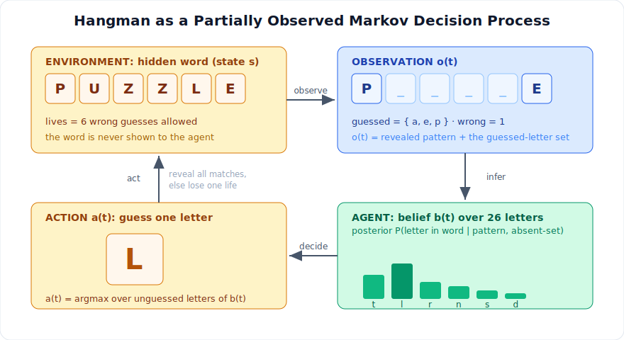
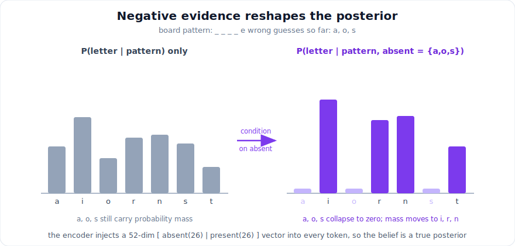
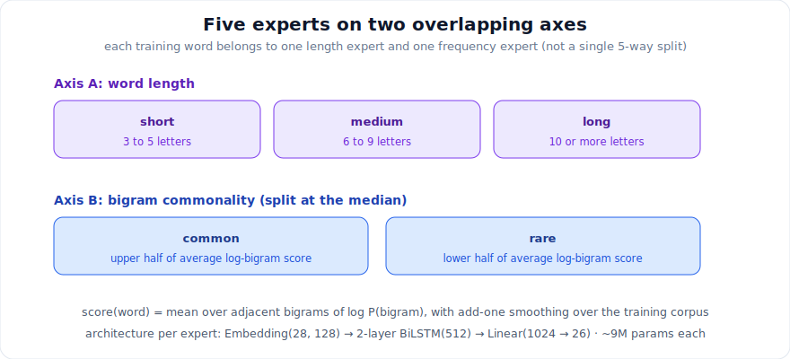
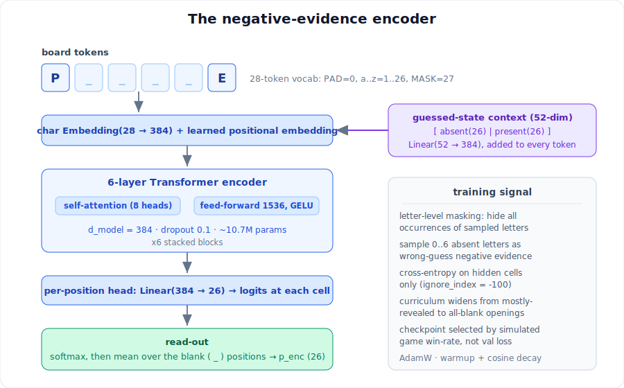
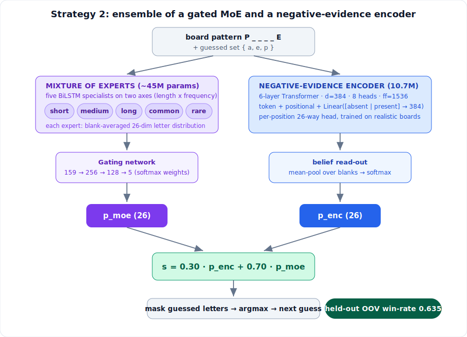
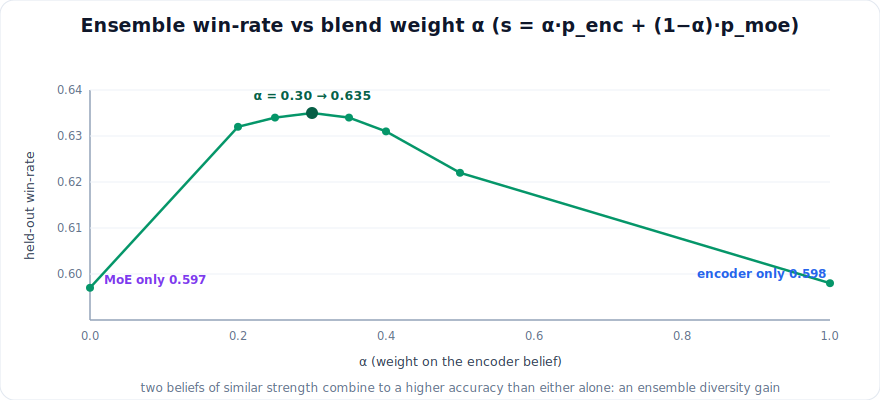
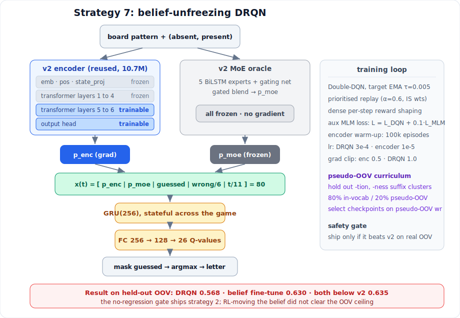

# Playing Hangman on Words It Has Never Seen: A Gated Mixture of Experts, a Negative-Evidence Encoder, and the Ensemble That Reached 63.5%

I was given the Trexquant Hangman challenge: build an agent that plays Hangman against a
remote server and wins as often as possible. The catch that governs the entire problem is
that the words the server tests me on are not in the dictionary I am given to train on. This
document records how I framed the task, the two models I built, the ensemble that combined
them, the number it reached on the out-of-vocabulary test condition (a win-rate of 0.635),
and the reasoning behind why that particular combination generalizes where other methods do
not. The final section reports the reinforcement-learning framework I designed to push past
0.635 and what it taught me.

All code is in `src/`. All Torch work runs in the `vessel` conda environment
(`~/miniconda3/envs/vessel/bin/python`, torch 2.1.0+cu118, CUDA on a 4 GB GTX 1650).

---

## 1. The task

The client plays Hangman against the trexsim server. A game runs as follows:

1. The server picks a hidden word and returns a masked pattern, a space-separated string
   such as `_ p p _ e`. Underscores are unknown positions; revealed letters are shown in
   place.
2. On each turn the client guesses one letter. If the letter is in the word, the server
   reveals every position where it occurs at once. If it is not, a wrong-guess counter goes
   up.
3. A game allows six wrong guesses. It is won when no underscores remain and lost when the
   sixth wrong guess is spent.

The modeling question at the center of every turn is one sentence: given the revealed
pattern and the set of letters already guessed, which letter is most likely to appear in a
hidden position.

### The constraint that defines the difficulty

The evaluation dictionary is disjoint from the training dictionary. To reproduce this
condition offline I clean the provided corpus (lowercase, alphabetic, length above two,
giving 227,019 words), shuffle with `seed=42`, and split 80/20 into 181,615 training words
and 45,404 held-out words. The held-out split shares zero words with the training split, so
every held-out game is played on a word the models were never trained on. I verified this
directly: 0 of the 45,404 held-out words occur in the 181,615-word training corpus. Every
win-rate reported here is measured on that held-out split, so it is an estimate of
out-of-vocabulary (OOV) performance, which is the only performance the challenge scores.

This single fact is the reason the project is hard and the reason most of the methods I
tried later failed. Any method that answers "which letter next" by consulting the training
dictionary is a nearest-neighbour lookup. It is correct on training words, where the answer
is literally in the corpus, and it misleads on OOV words, where the consistent set of
training words often does not even contain the true letters.

---

## 2. Hangman is a partially observed Markov decision process

The word is a hidden state. I never see it directly. I see an observation, the masked
pattern plus the guessed-letter set. I choose an action, one letter. The environment
responds with a deterministic transition: it reveals every matching position, or it charges
me one of my six lives. The episode ends in a win or a loss. This is a partially observed
Markov decision process (POMDP), and the standard decomposition of a POMDP is the frame I
used: maintain a belief over the hidden state, then apply a decision rule to the belief.

<div align="center">
  
</div>

The belief I actually need is not a distribution over whole words. The decision is per
letter: "does letter x appear in at least one hidden cell." So the useful belief is a
26-dimensional vector, one score per letter, and the decision rule is to mask the letters I
have already guessed and take the argmax of what remains. Almost the entire engineering
effort goes into the belief. The decision rule stays a single line.

Two properties of the belief matter for OOV words. First, it must condition on negative
evidence: the letters I guessed that turned out to be absent reshape the posterior over the
remaining letters, and ignoring them throws away information the player has. Second, it must
generalize across morphology rather than memorize training words, because at test time the
word is new.

---

## 3. The belief objective: masked language modeling with negative evidence

I treat a partially revealed word as a masked-language-modeling problem. A model reads the
board with unknown positions marked by a mask token and predicts, at every position, a
distribution over the 26 letters. The shared vocabulary across every model in the project is
fixed so checkpoints stay comparable: `PAD=0`, `a..z = 1..26`, `MASK=27`, for a vocabulary
size of 28. Letter targets and outputs use the `0..25` range.

To turn a matrix of per-position distributions into one guess, I softmax the logits, average
the distributions over the blank positions only, mask the already-guessed letters, and take
the argmax. This "average over blanks" reduction is the inference primitive used everywhere
in the codebase.

The property that most affects OOV accuracy is conditioning on negative evidence. Consider a
board `_ _ _ _ e` where I have already guessed `a`, `o`, and `s` and been told all three are
absent. A model that sees only the pattern still assigns probability to `a`, `o`, and `s`. A
model that also receives the wrong-guess set collapses those to zero and redistributes their
mass onto letters that remain possible. The posterior it produces is the correct one:
`P(letter in word | pattern, absent-set)`, not `P(letter in word | pattern)`.

<div align="center">
  
</div>

---

## 4. Component one: a gated mixture of five expert BiLSTMs

The first belief model is a mixture of experts. Instead of one generalist, I train five
BiLSTM specialists, each on a slice of the vocabulary, on the hypothesis that letter
statistics differ by word length and by how common a word's letter patterns are.

### The two axes

The five experts are carved along two independent axes. Each training word belongs to one
length expert and one frequency expert at the same time, so the experts overlap rather than
forming a single 5-way partition.

<div align="center">
  
</div>

The length axis gives `short` (3 to 5 letters), `medium` (6 to 9), and `long` (10 or more).
The frequency axis is built from a character-bigram language model over the whole training
set. Each word gets a commonality score equal to its average log bigram probability under
add-one smoothing, words are sorted by that score, and the split at the median gives
`common` (upper half) and `rare` (lower half).

### Architecture and training

Each expert is an `Embedding(28, 128)` into a 2-layer bidirectional LSTM with hidden size
512, into a `Linear(1024, 26)` head that emits per-position logits. That is about 9M
parameters per expert and roughly 45M across the five. Training uses self-supervised masking
with a curriculum that raises the mask ratio over 60 epochs, from mostly-revealed boards
toward mostly-blank boards, so the experts first learn easy boards and then the opening
boards that dominate the first few moves of a real game.

### The gating network

A uniform average of the five experts weights every expert equally regardless of context.
The gating network learns to weight the experts by the current game state, so the `long`
expert can be trusted more on a long word and the `rare` expert more on an unusual pattern. I
generate its training data by self-play: the uniform ensemble plays 10,000 training words,
and at every turn I record a 159-dimensional feature (29 state features, including a one-hot
of guessed letters, concatenated with the five experts' 26-dimensional blank-averaged
probability vectors). The label is a 5-dimensional binary vector recording, for each expert,
whether that expert's own top guess would have been correct on this board.

The gate is a small multilayer perceptron, `159 → 256 → 128 → 5`, about 74.5K parameters,
trained with `BCEWithLogitsLoss` as a multi-label objective, each output an independent
estimate that the corresponding expert is correct. At inference the same five logits pass
through a softmax to produce convex mixture weights that sum to one. The training objective
(independent per-expert correctness) and the inference use (relative weighting via softmax)
are not the same transformation. It works as a heuristic because an expert the gate judges
more likely to be correct produces a larger logit and therefore a larger weight. This is the
notable design subtlety of the mixture.

On the held-out split this gated mixture wins 0.597 of games at an average of 3.97 wrong
guesses. That is the baseline I set out to beat.

---

## 5. Component two: a negative-evidence Transformer encoder

I built the second belief model by first diagnosing three flaws in the mixture-of-experts
training that limit its posterior.

1. **Impossible training boards.** The original masking hid random individual positions, so
   it could hide one `p` in `apple` while showing the other (`a p _ l e`). Real Hangman
   reveals all occurrences of a letter at once. The experts were trained on boards they never
   meet at test time.
2. **No negative evidence.** The input never encoded wrong guesses. Output-masking stops the
   model from re-guessing a known-absent letter, but the probability estimates never
   conditioned on the absent set, which reshapes the true posterior.
3. **Aggregation not matched to the objective.** Averaging per-position probabilities
   estimates the wrong quantity. The decision is "letter appears in at least one hidden
   cell," whose aligned estimator is the noisy-OR `1 − Π(1 − p_i)`.

The encoder addresses the first two directly and treats the third as an empirical question.

<div align="center">
  
</div>

**Letter-level masking.** For each word I hide all occurrences of a sampled set of letters,
so the training board has the exact form of a real board.

**Negative-evidence conditioning.** I sample a set of absent letters disjoint from the word
and build a 52-dimensional context vector `[absent(26) | present(26)]`. A `Linear(52, 384)`
projects it and adds it to every token embedding, so the prediction is a posterior given
everything the player knows.

**Architecture.** A character `Embedding(28, 384)` and a learned positional embedding feed a
6-layer Transformer encoder (d_model 384, 8 heads, feed-forward 1536, GELU, dropout 0.1)
into a per-position 26-way head. About 10.7M parameters. Cross-entropy is applied only on the
hidden positions (`ignore_index = -100`). A curriculum widens the board difficulty from
mostly-revealed with few wrong guesses toward all-blank openings with up to six wrong
guesses. The optimizer is AdamW with warmup and cosine decay, and I select the checkpoint by
simulated game win-rate rather than validation loss, because win-rate is the objective and
loss is only a proxy for it.

**On the noisy-OR question.** I A/B tested mean aggregation against noisy-OR in the game
simulator. Noisy-OR was not better. On an all-blank opening, `1 − Π(1 − p_i)` saturates
toward one for many letters and loses the ranking discrimination that decides the early
guesses. Mean aggregation kept the discrimination, so mean is what I use.

On the held-out split this encoder wins 0.598 of games with mean aggregation, at parity with
the mixture. A single model of this size does not out-muscle a 45M-parameter five-expert
ensemble on its own. An earlier undersized version (3.2M parameters, 25 epochs) reached only
0.538. The value of the encoder is not that it beats the mixture. It is that it is a second,
independently trained belief that makes different mistakes.

---

## 6. The ensemble: blend two beliefs, then decide

The decisive step is combining the two beliefs at the score level. Both models emit a
26-dimensional letter-score vector for the current board: the encoder through per-position
softmax averaged over hidden cells, the mixture through the gated weighted average of its
five experts. I blend them, mask guessed letters, and take the argmax:

```
score = alpha * p_encoder + (1 - alpha) * p_moe
guess = argmax over unguessed letters of score
```

<div align="center">
  
</div>

Sweeping the blend weight on the held-out split locates a clear interior optimum. The
encoder alone and the mixture alone both sit near 0.598, and their blend rises above both.

<div align="center">
  
</div>

The peak is at `alpha = 0.30`, meaning the guess uses 0.30 of the encoder belief and 0.70 of
the mixture. The measured sweep is: 0.20 gives 0.632, 0.25 gives 0.634, 0.30 gives 0.635,
0.35 gives 0.634, 0.40 gives 0.631, and 0.50 gives 0.622.

### Results on the held-out (OOV) split, 3,000 simulated games

| Policy | Win-rate | Avg wrong |
|---|---|---|
| Gated mixture of experts (baseline) | 0.597 | 3.97 |
| Negative-evidence encoder, mean | 0.598 | 4.00 |
| Negative-evidence encoder, noisy-OR | 0.597 | 4.01 |
| **Ensemble, alpha = 0.30, mean** | **0.635** | **3.85** |

The ensemble adds 3.8 points of win-rate over the baseline (a 6.4% relative gain) and lowers
the average wrong-guess count from 3.97 to 3.85. The deployment client defaults to this
policy: encoder blended with the mixture at `alpha = 0.30` with mean aggregation, and it
keeps a dictionary-frequency fallback if the model checkpoints fail to load.

---

## 7. Why this combination generalizes

Two questions are worth separating: why the ensemble beats either model, and why the whole
approach holds up on OOV words when other approaches do not.

**Why the ensemble beats either model.** The two beliefs are of similar strength but arrive
at their scores through different mechanisms. The mixture reads word length and bigram
frequency through specialists selected by a learned gate. The encoder reads the entire board
through self-attention and conditions on the exact absent and present sets. Because they are
trained separately with different inductive biases, their errors are partly uncorrelated.
Averaging two beliefs that are individually right about 60% of the time but wrong on
different boards recovers accuracy that neither has alone. The 0.30/0.70 weight simply
reflects that the mixture is the steadier of the two, so it carries more of the blend while
the encoder corrects it where negative evidence matters.

**Why the approach survives OOV.** Both beliefs are neural marginals. Neither one looks up
the training dictionary at inference time. They learned statistical structure (letter
co-occurrence, morphology, the effect of absent letters) that transfers to unseen words. I
confirmed that this is the property that matters by testing the opposite kind of method and
watching it fail on OOV:

- **A one-step decision oracle (PIMC).** I built a perfect-information Monte Carlo policy
  that samples consistent completions from the training corpus and picks the provably better
  one-step guess. On training words it lifts win-rate from 0.617 to 0.833, a gain of 0.217.
  On the held-out OOV split it moves win-rate from 0.600 to 0.560, a loss of 0.040. The
  provable improvement is entirely in-distribution and reverses sign on OOV.
- **Belief-sharpening.** Blending the ensemble with the exact training-corpus marginal
  (the letter frequencies over all consistent training words) loses about 3.7 points on OOV
  at every mixing gate I tried. On an OOV word the consistent training set often lacks the
  true letters, so leaning toward it misleads.
- **Distillation of the oracle.** Imitating the PIMC oracle's decisions degrades OOV
  monotonically as training proceeds, down 0.134 by 40 epochs, because distillation transfers
  the corpus overfitting rather than a generalizable rule.

The common thread is that any belief built by consulting the training dictionary is a sharp
nearest-neighbour that is right in-distribution and wrong on OOV, while the neural marginal
generalizes. The ensemble wins because it is two independent neural marginals and nothing
that reads the corpus at inference time. Its 0.635 is a number that transfers to words the
system has never seen.

---

## 8. Files and reproduction

Pipeline in `src/`:

| File | Role |
|---|---|
| `vocab.py` | Shared vocabulary and constants (PAD=0, a..z=1..26, MASK=27). |
| `data.py` | `HangmanStateDataset` (letter-level masking, absent/present features), `collate_fn`, the seed-42 split. |
| `model.py` | `HangmanEncoder` (Transformer; BiLSTM behind a flag), with a differentiable `encode()` path. |
| `train.py` | Curriculum training of the encoder, win-rate checkpointing to `models/hangman_encoder.pt`. |
| `train_experts.py` | Trains the five BiLSTM experts. |
| `train_gate.py` | Self-play collection and training of the gating network. |
| `evaluate.py` | `play_game` / `evaluate_winrate` simulator, `predict_letter`, and the re-implemented mixture for apples-to-apples comparison. |
| `ensemble.py` | Score-level encoder-plus-mixture blend and the alpha sweep. |
| `play_online.py` | Live client with the ensemble `guess()`; defaults to `alpha=0.3`, mean aggregation; dictionary fallback. |

Commands (all in `vessel`):

```bash
# train the encoder (checkpoint already at models/hangman_encoder.pt)
~/miniconda3/envs/vessel/bin/python src/train.py --epochs 40 --d_model 384 --layers 6 --ff 1536

# evaluate offline against the mixture baseline on the held-out (OOV) split
~/miniconda3/envs/vessel/bin/python src/evaluate.py --baseline --num 3000
~/miniconda3/envs/vessel/bin/python src/ensemble.py --num 3000 --alphas 0.25,0.3,0.35

# play online (needs a valid trexsim access token)
~/miniconda3/envs/vessel/bin/python src/play_online.py --token <TOKEN> --games 100 --practice 1
```

---

## 9. Strategy 7: making the belief trainable with a belief-unfreezing DRQN

The 0.635 ensemble applies a trivial decision rule to a frozen belief. Every attempt I made
to improve the decision rule on top of the frozen belief shipped exactly the 0.635 policy,
because the PIMC experiment in the previous section showed the decision layer has no positive
OOV headroom. The one lever left is the belief's own OOV generalization. Strategy 7 is the
framework I designed to pull that lever: a deep recurrent Q-network (DRQN) that does not
freeze the belief but fine-tunes its top layers under a reinforcement objective, with a
curriculum that rewards generalization across morphology.

<div align="center">
  
</div>

**Architecture and freeze map.** The strategy 2 encoder is reused, with layers 1 to 4, the
embedding, the positional embedding, and the state projection frozen, and only layers 5 to 6
and the output head left trainable (about 3.56M trainable parameters). The gradient from the
reinforcement objective reaches these top blocks, so the agent can reshape the marginal on
OOV-like words rather than only re-order a fixed one. The mixture of experts stays a frozen
oracle: it supplies a second belief the agent can lean on while the encoder's top layers are
in flux, and lean away from as the board becomes diagnostic. The two beliefs `p_enc` and
`p_moe`, together with a guessed multi-hot, the normalized wrong count, and the normalized
step index, form an 80-dimensional input to a `GRU(256)` and a `FC(256 → 128 → 26)` Q-head.
The action is the masked argmax of the Q-values, so no fixed blend weight is used at
inference; the Q-values encode the state-conditioned reliability of each belief.

**Training.** The loss is a Double-DQN temporal-difference error with a target network
updated by an exponential moving average, plus an auxiliary masked-language-modeling term
weighted at 0.1 that pulls the trainable encoder weights back toward their pretrained
distribution. Experience is stored in a prioritized episode replay that recomputes `p_enc`
with gradient on each training step, since storing a detached belief would sever the encoder
gradient and reduce the method to a frozen-belief DRQN. The reward is dense and per step,
paying for revealed positions and penalizing wrong guesses. The two parameter groups use
separate learning rates (3e-4 for the DRQN, 1e-5 for the encoder top layers) and separate
gradient clips. The encoder stays frozen for the first 100k episodes so the DRQN reaches a
stable policy before the belief starts moving.

**The pseudo-OOV curriculum.** This is the mechanism that targets generalization. I cluster
the training words by their morphological suffix and hold out whole distinctive clusters:
the `-tion` and `-ness` suffix families, 7,093 words, leaving 174,522 in-vocab. During
training, 80% of episodes draw from the in-vocab set and 20% from the held-out pseudo-OOV
set, and I select checkpoints purely on pseudo-OOV win-rate. The selection criterion is
itself an OOV test, so the encoder is rewarded for building suffix-general representations
rather than memorizing training idiosyncrasies. The real 45,404-word OOV set is never
touched until a single final paired evaluation.

**Result.** The framework runs and learns. Pseudo-OOV win-rate climbs steadily through
training. But on the real held-out OOV set, gated against strategy 2 on the same 3,000
games, the DRQN reaches 0.568 (down 0.067 from 0.635), and a lighter supervised variant that
fine-tunes only the belief with the auxiliary MLM objective reaches 0.630 (down 0.005). A
no-regression gate ships strategy 2 in both cases. The pattern was diagnostic: the trainable
encoder fit the pseudo-OOV suffix clusters and the training dynamics, which is a milder
version of the same corpus overfitting that sank PIMC, belief-sharpening, and distillation.
Moving the belief with a reinforcement signal did not clear the ceiling that the frozen
neural marginal already sits near.

The result that ships is strategy 2: two independently trained neural beliefs, blended at
0.30/0.70, masked, argmaxed. It reaches 0.635 on words it has never seen, and every method I
built to beat it confirmed why it holds. The number that counts is win-rate on
out-of-vocabulary words, and on that number the generalizing neural marginal is the thing to
protect.
